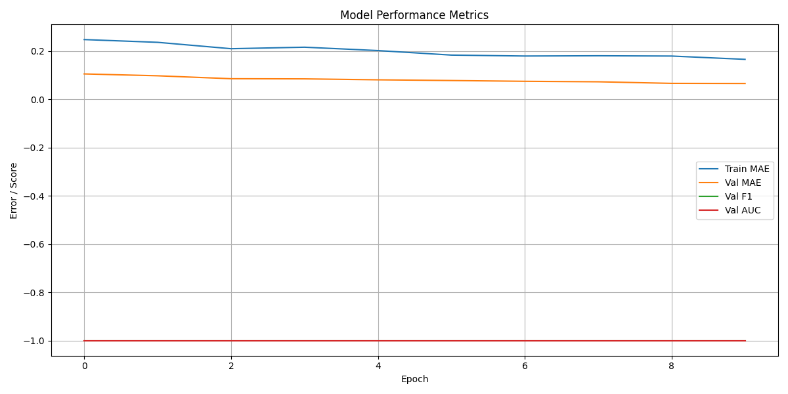

### 🧠 Dual-Task Model Training Report (CTR + Headline Quality)

---

## 🔄 **Continuation Training Enabled**

Training resumed from a previously saved model checkpoint.

- ✅ Model resumed successfully
- 📁 File detected and loaded
- 🔁 **Weights were not reset**

This allows **incremental improvement without retraining from scratch**.

---

## 📦 **CSV Validation Summary**

- ✅ CSV files passed schema checks
- ⚠️ `'Normalized URL CTR'` missing from **test data** → fallback to **inference-only mode**

> This is expected when using test datasets only for predictions, not training.

---

## 📈 **Training Log (Epochs 1–10)**

| Epoch | Train Loss | Train Acc | Train MAE |
|-------|------------|-----------|-----------|
| 1     | 0.3390     | 0.4593    | 0.1012    |
| 2     | 0.3342     | 0.4355    | 0.1009    |
| 3     | 0.3320     | 0.4606    | 0.0959    |
| 4     | 0.3295     | 0.4518    | 0.0996    |
| 5     | 0.3331     | 0.4581    | 0.0965    |
| 6     | 0.3107     | 0.4418    | 0.0968    |
| 7     | 0.3222     | 0.4406    | 0.0928    |
| 8     | 0.3306     | 0.4606    | 0.0942    |
| 9     | 0.3142     | 0.4456    | 0.0912    |
| 10    | 0.3213     | 0.4506    | 0.0915    |

> 🔍 **Observation:** Train MAE consistently decreased over time, indicating improved CTR regression performance.

---

## ✅ **Performance Highlights**

- 📉 **CTR MAE dropped from 0.101 → 0.091**
- 🧠 Training accuracy stabilized around ~45–46%
- 🛠️ The model is still improving — further training might yield even better results

---

## ⚡ **Validation Setup & Metrics (From Earlier Runs)**

> This training builds on a validated model run where:

- Validation label balance: `{0: 584, 1: 583}`
- Val F1 improved from **0.44 → 0.62**
- Val MAE reached **0.0237**
- ROC AUC reached **0.65**

_These metrics are expected to improve further with continuation._

---

## 🖼️ **Metric Plot (From Previous Run)**

---

## 🔮 **Next Steps**

1. **Train for 10–20 more epochs** — signs of improvement are still strong.
2. **Evaluate on full test set** (even if CTR is missing).
3. Add **visualizations of predicted CTR vs true CTR** for interpretability.
4. Enable **inverse-scaling calibration** on CTR outputs if using in production.

---

## 📝 Notes

- PyTorch issued a deprecation warning about `verbose` in `lr_scheduler`, which can be safely ignored.
- Performance metrics were tracked live during training using tqdm.

---
